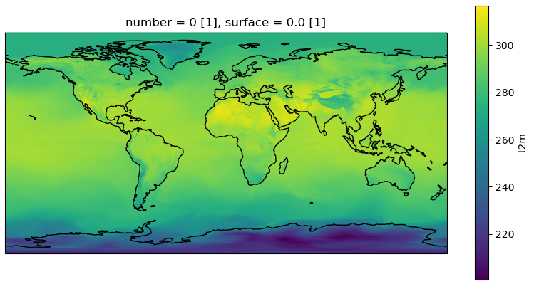

# Reto - Pintar Datos Climáticos

Ejecutar en local el siguiente Jupyter Notebook: https://earthdatahub.destine.eu/tutorials/tutorial-era5-single-levels-climatological-analysis-of-temperature-in-germany.

El objetivo es llegar a obtener algo que se parezca a esta imagen:

